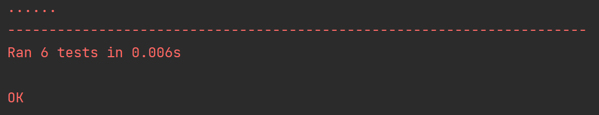

# Dependency Visualizer

Dependency Visualizer — это инструмент на Python для анализа зависимостей NuGet пакетов (`.nupkg`) и создания графического представления этих зависимостей с использованием диаграмм Mermaid.

## Возможности
- Извлечение зависимостей из `.nupkg` файлов.
- Генерация графов зависимостей в формате Mermaid.
- Преобразование диаграмм Mermaid в изображения с настраиваемым разрешением.

## Требования
- Python версии 3.7 или выше.
- Необходимые модули Python:
  - `configparser`
- Конфигурационный файл (`.ini`), определяющий основные пути и настройки.
- Mermaid CLI для генерации изображений из диаграмм Mermaid. Установить можно с помощью команды:
  ```bash
  npm install -g @mermaid-js/mermaid-cli
  ```

## Установка
1. Клонируйте репозиторий или загрузите файл `main.py`.
2. Установите необходимые модули Python:
   ```bash
   pip install configparser
   ```
3. Установите Mermaid CLI:
   ```bash
   npm install -g @mermaid-js/mermaid-cli
   ```

## Конфигурация
Создайте конфигурационный файл (например, `config.ini`) со следующей структурой:
```ini
[Main]
PackageName = example-package
OutputPath = ./output
VisualizerPath = /path/to/mmdc
```
- **PackageName**: Имя анализируемого пакета.
- **OutputPath**: Путь для сохранения сгенерированного изображения.
- **VisualizerPath**: Путь к исполняемому файлу Mermaid CLI (`mmdc`).

## Использование
Запустите скрипт из терминала с помощью следующей команды:
```bash
python main.py <config_path> <package_path>
```
- `<config_path>`: Путь к конфигурационному файлу.
- `<package_path>`: Путь к анализируемому `.nupkg` файлу.

### Пример
```bash
python main.py config.ini mypackage.nupkg
```
### Пример графа зависимостей
Ниже приведен пример сгенерированного Mermaid-графа:
https://imgur.com/a/A9TSpW3

### Результат тестирования


## Рабочий процесс
1. **Извлечение зависимостей**: Скрипт распаковывает `.nupkg` файл и извлекает зависимости, указанные в `.nuspec` файле.
2. **Генерация графа Mermaid**: Зависимости преобразуются в формат диаграммы Mermaid.
3. **Генерация изображения**: Диаграмма Mermaid рендерится в изображение с помощью Mermaid CLI.

## Результат
- Полученное изображение графа зависимостей сохраняется в пути, указанном в `OutputPath`.

## Обработка ошибок
- Скрипт выводит подробные сообщения об ошибках для отсутствующих файлов, неправильной конфигурации или проблем при извлечении зависимостей.

## Разработка
Для расширения или модификации скрипта используйте следующие ключевые компоненты:
- `DependencyVisualizer._load_config`: Загружает конфигурацию из `.ini` файла.
- `DependencyVisualizer.extract_dependencies`: Извлекает зависимости из `.nupkg` файла.
- `DependencyVisualizer.generate_mermaid_graph`: Создает строку графа Mermaid.
- `DependencyVisualizer.generate_image`: Преобразует граф Mermaid в изображение.

## Устранение неполадок
1. **Mermaid CLI не найден**:
   Убедитесь, что `VisualizerPath` в конфигурационном файле указывает на правильный исполняемый файл `mmdc`.
2. **Отсутствуют зависимости в `.nupkg`**:
   Проверьте, что `.nuspec` файл внутри `.nupkg` содержит корректные узлы `<dependencies>`.
